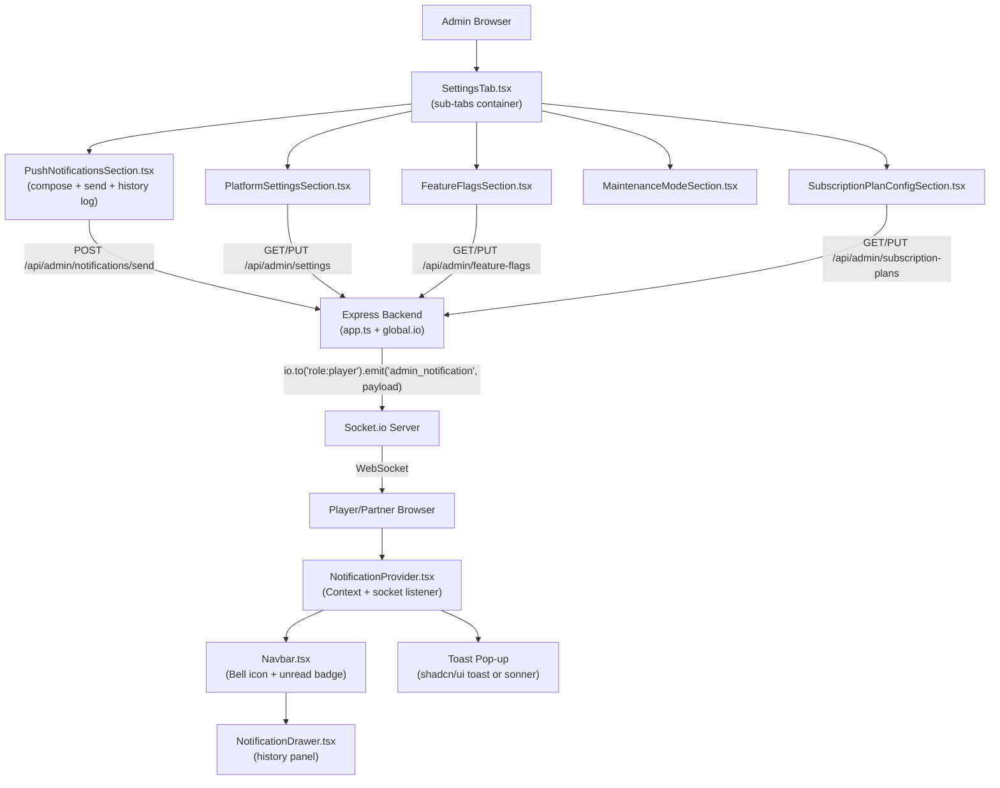

# System Design & Architecture

## Architecture Overview



**Key insight:** Socket.io is already running in `app.ts` and `global.io` is globally accessible. This is the same pattern as `lobby_update` for tournaments — no new infrastructure needed.

---

## Data Models

### New Prisma Models

```prisma
model Notification {
  id         String   @id @default(cuid())
  title      String
  body       String
  targetType String   // "all" | "players" | "partners" | "tier:PRO" | "tier:ENTERPRISE"
  sentBy     String   // admin userId
  sentAt     DateTime @default(now())
  scheduled  Boolean  @default(false)
  scheduledAt DateTime?
  status     String   @default("sent") // "sent" | "scheduled" | "cancelled"
  
  sender     User     @relation(fields: [sentBy], references: [id])
}

model PlatformSetting {
  id        String   @id @default(cuid())
  key       String   @unique  // "maintenance_mode", "platform_fee_pct", "max_lobby_players"
  value     String
  type      String            // "boolean" | "number" | "string"
  label     String
  group     String            // "general" | "financial" | "limits"
  updatedAt DateTime @updatedAt
  updatedBy String?
}

model FeatureFlag {
  id          String   @id @default(cuid())
  key         String   @unique
  enabled     Boolean  @default(false)
  description String
  updatedAt   DateTime @updatedAt
  updatedBy   String?
}

model NotificationTemplate {
  id        String   @id @default(cuid())
  name      String   @unique
  title     String
  body      String
  createdBy String
  createdAt DateTime @default(now())
  updatedAt DateTime @updatedAt
}
```

```prisma
// Replaces hardcoded priceMap + feature list in AdminPartnerSubscriptionTab.tsx
model SubscriptionPlanConfig {
  id                    String   @id @default(cuid())
  plan                  String   @unique  // "FREE" | "PRO" | "ENTERPRISE"
  monthlyPrice          Float    @default(0)
  annualPrice           Float    @default(0)
  maxLobbies            Int      @default(1)   // max active mini-tour lobbies a partner can create
  maxPlayersPerLobby    Int      @default(8)
  maxTournamentsPerMonth Int     @default(5)
  // Per-plan feature toggles as JSON, e.g.:
  // { "customBranding": false, "analyticsExport": false, "prioritySupport": false, "revenueShare": false }
  features              Json     @default("{}")
  updatedAt             DateTime @updatedAt
  updatedBy             String?
}
```

> **Note:** No `DeviceToken` table needed — delivery is via Socket.io only.
>
> **`SubscriptionPlanConfig` replaces** the hardcoded `priceMap` in `AdminPartnerSubscriptionTab.tsx`. The backend reads a partner's plan config when enforcing limits (e.g., "can this partner create another lobby?"). The existing `PartnerSubscription.features` Json field on individual partners can hold plan-level overrides if needed in the future.

---

## Socket.io Event Design

### Server → Client Events

| Event | Room | Payload |
|-------|------|---------|
| `admin_notification` | `role:player`, `role:partner`, or `role:all` | `{ id, title, body, sentAt }` |
| `maintenance_mode` | `role:all` | `{ enabled: true, message: "..." }` |

### Client → Server Events (on connection)

| Event | Purpose |
|-------|---------|
| `join_role_room` | Client tells server its role so it's added to `role:player` or `role:partner` room |

### Backend Emit (in notification controller)

```typescript
// Emit to the correct socket room based on targetType
function getSocketRoom(targetType: string): string {
  if (targetType === 'players') return 'role:player';
  if (targetType === 'partners') return 'role:partner';
  if (targetType.startsWith('tier:')) return `tier:${targetType.split(':')[1]}`;
  return 'role:all'; // "all"
}

const io = (global as any).io;
io.to(getSocketRoom(targetType)).emit('admin_notification', {
  id: notificationRecord.id,
  title,
  body,
  sentAt: new Date().toISOString(),
});
```

---

## API Design

### Notifications

| Method | Endpoint | Description |
|--------|----------|-------------|
| `POST` | `/api/admin/notifications/send` | Send notification → emits socket event + saves to DB |
| `GET` | `/api/admin/notifications/history` | Paginated sent notifications log |
| `GET` | `/api/admin/notifications/templates` | List templates |
| `POST` | `/api/admin/notifications/templates` | Create template |
| `DELETE` | `/api/admin/notifications/templates/:id` | Delete template |

### Platform Settings

| Method | Endpoint | Description |
|--------|----------|-------------|
| `GET` | `/api/admin/settings` | All settings grouped |
| `PUT` | `/api/admin/settings/:key` | Update a setting |

### Feature Flags

| Method | Endpoint | Description |
|--------|----------|-------------|
| `GET` | `/api/admin/feature-flags` | All feature flags |
| `PUT` | `/api/admin/feature-flags/:key` | Toggle a flag |

### Subscription Plan Configuration

| Method | Endpoint | Description |
|--------|----------|-------------|
| `GET` | `/api/admin/subscription-plans` | All 3 plan configs (FREE / PRO / ENTERPRISE) |
| `PUT` | `/api/admin/subscription-plans/:plan` | Update a plan's price, limits, or features |

---

## Component Breakdown

### Frontend — New Components

| Component | Location | Purpose |
|-----------|----------|---------|
| `NotificationProvider.tsx` | `components/` | React Context; holds notification list in state; listens on `admin_notification` socket event; shows toast on new notification |
| `NotificationBell.tsx` | `components/` | Bell icon with unread count badge; opens `NotificationDrawer` |
| `NotificationDrawer.tsx` | `components/` | Side panel listing all notifications; mark-as-read controls |
| `SocketProvider.tsx` | `components/` | Wraps app with `socket.io-client` connection; joins role room on connect |

### Frontend — Admin Settings Components

| Component | Location | Purpose |
|-----------|----------|---------|
| `SettingsTab.tsx` | `app/.../admin/components/` | Refactored: inner sub-tabs (Notifications, Platform, Feature Flags, Maintenance, **Plans**) |
| `PushNotificationsSection.tsx` | `app/.../admin/components/` | Compose + send + history table + templates |
| `PlatformSettingsSection.tsx` | `app/.../admin/components/` | Key→value settings list with inline edit |
| `FeatureFlagsSection.tsx` | `app/.../admin/components/` | Toggle list |
| `MaintenanceModeSection.tsx` | `app/.../admin/components/` | On/off toggle + message |
| `SubscriptionPlanConfigSection.tsx` | `app/.../admin/components/` | Side-by-side plan cards (FREE / PRO / ENTERPRISE) showing prices, limits (editable inputs), and feature toggles per plan; save button per plan |

### Backend — New Files

| File | Purpose |
|------|---------|
| `controllers/adminNotifications.controller.ts` | Send notification (emit + save), history, templates |
| `controllers/adminSettings.controller.ts` | Settings + feature flags CRUD |
| `routes/adminNotifications.routes.ts` | Route definitions |
| `routes/adminSettings.routes.ts` | Route definitions |
| `sockets/notifications.ts` | `join_role_room` socket event handler + room join logic |

---

## Design Decisions

1. **Socket.io for in-app delivery:** Reuses the existing `global.io` pattern from tournament lobby updates. No Firebase, no device tokens, no new infrastructure needed — notifications only reach currently-connected clients.
2. **Role rooms for targeting:** Clients join `role:player` or `role:partner` on socket connect. Admin emits to the matching room.
3. **Client notification state:** `NotificationProvider` (React Context) holds the array in state. Persists to `localStorage` for cross-page persistence.
4. **DB for admin log:** Sent notifications saved to `Notification` table for admin audit log.
5. **Optimistic UI for toggles:** Feature flags and maintenance mode toggle optimistically.
6. **`sonner` for toasts:** Use existing `toast` component from shadcn/ui.
7. **`SubscriptionPlanConfig` as source of truth for plan limits:** The backend reads plan limits (`maxLobbies`, `maxPlayersPerLobby`, etc.) from the `SubscriptionPlanConfig` table — never from hardcoded values. When plan config changes, it takes effect immediately for all partners on that plan. Individual partner `PartnerSubscription.features` can override plan-level features for one-off cases.

---

## Non-Functional Requirements

- **Latency:** Notification should appear on client within 2 seconds of admin click
- **No offline delivery:** Only connected clients receive the notification
- **Security:** Admin routes protected by existing JWT middleware; RBAC: `role: ADMIN` required
- **Persistence:** Notification history stored in `localStorage` + DB (for log view only)
