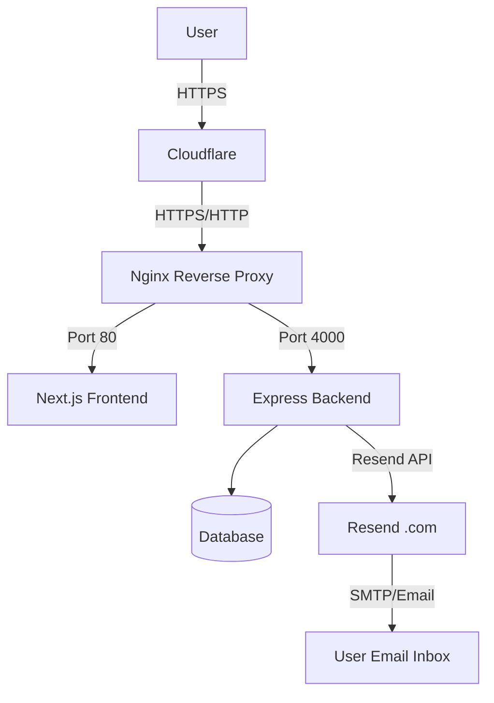

# System Design & Architecture

## Architecture Overview
**What is the high-level system structure?**

## Data Models
**What data do we need to manage?**
- Adding `resetPasswordToken` (String) and `resetPasswordExpires` (DateTime) to user tracking records in the Database.

## Infrastructure Design
**Domain & Cloudflare:**
- Cloudflare will manage DNS records pointing to the VPS IP.
- SSL/TLS encryption will be enabled in Cloudflare.
- Real IP forwarding configurations will be necessary in Nginx.

**Docker Compose (`docker-compose.yml`):**
- Pass new environment variables to the backend container:
  - `RESEND_API_KEY`
  - `EMAIL_FROM_ADDRESS` (e.g., `noreply@testictour.com`)

**Nginx Configuration (`nginx-vps.conf`):**
- Continue handling reverse-proxy logic, ensuring `X-Forwarded-For`, `X-Forwarded-Proto`, and `X-Real-IP` are accurately passed from Cloudflare to the Docker containers to keep client IPs true.

## API Design
**How do components communicate?**
- `POST /api/auth/forgot-password` (Requires email + role)
- `POST /api/auth/reset-password` (Requires token + new password)

## Component Breakdown
**What are the major building blocks?**
- **Frontend Components:** `ForgotPassword` and `ResetPassword` views in Next.js.
- **Backend Services:** 
  - `AuthController`: Request handling.
  - `MailService`: Specifically integrating the `resend` Node SDK.
- **Infrastructure:**
  - `docker-compose.yml` updates.
  - `nginx-vps.conf` updates.
