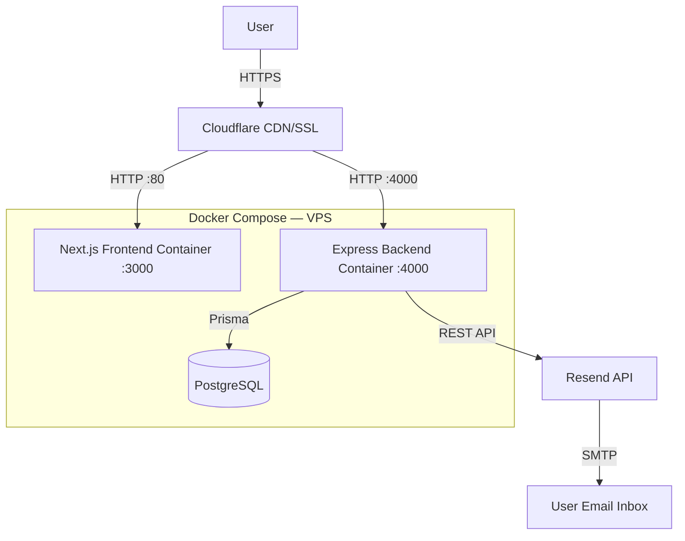
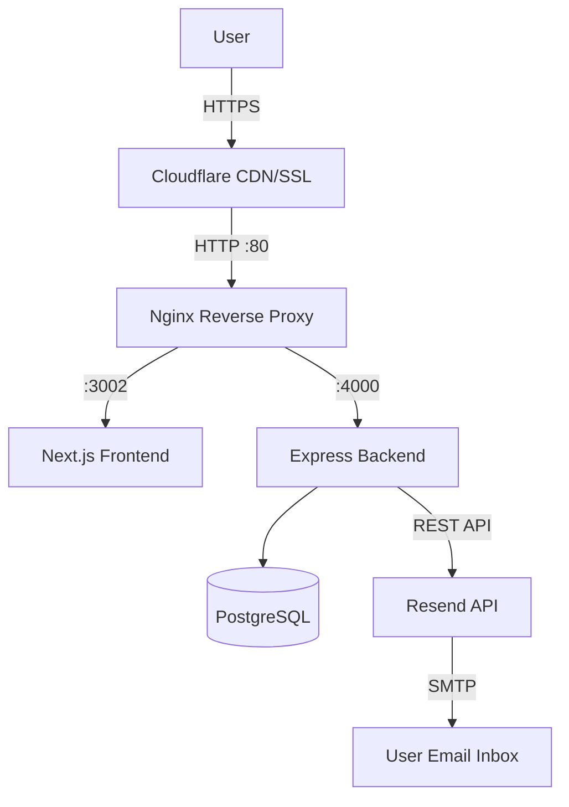
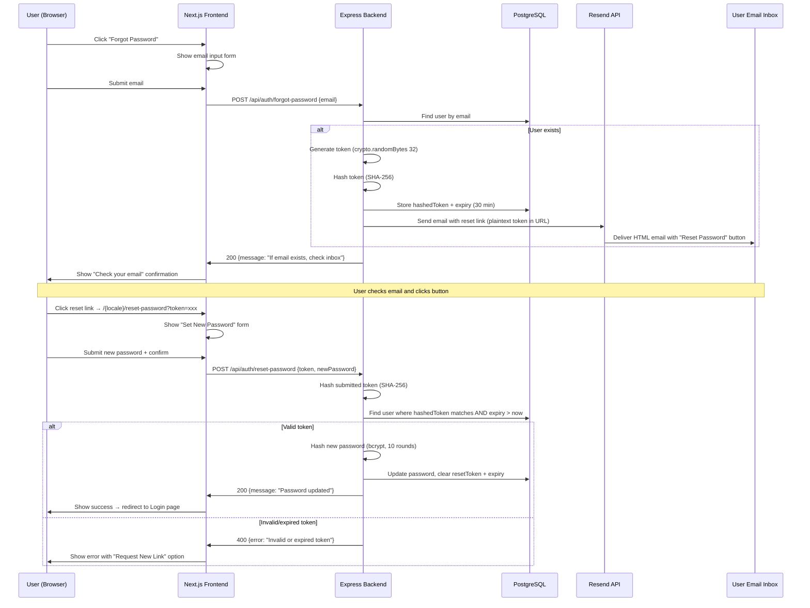

# System Design & Architecture

## Architecture Overview
**What is the high-level system structure?**

### Current Deployment Topology (Development / Early Production)
> Port 80 is mapped directly from Docker to the Next.js frontend container. Nginx config is prepared but **not active** yet — it will be switched on during production cutover.



### Future Production Topology (with Nginx)


### Password Reset Flow — Sequence Diagram


### Technology Stack
| Layer | Technology | Rationale |
|---|---|---|
| Email Provider | **Resend** (SDK: `resend`) | Team decision. Simple API, good deliverability, React Email support for templates. |
| Token Generation | `crypto.randomBytes(32)` | Node.js built-in, 256-bit entropy, no external dependency. |
| Token Storage | SHA-256 hash in DB | If DB is compromised, raw tokens are not exposed. Same pattern as GitHub/Stripe. |
| Password Hashing | `bcrypt` (10 rounds) | Already used in `UserService.register()` — consistency. |
| Rate Limiting | In-memory with `express-rate-limit` | Simple, no Redis needed. Sufficient for current scale. Can upgrade to Redis-backed later. |
| Email Templates | HTML string with inline CSS | Resend supports React Email, but plain HTML is simpler for v1. Bilingual via `locale` parameter. |

---

## Data Models
**What data do we need to manage?**

### Schema Changes — `User` model
Add two fields to the existing `User` model in `schema.prisma`:

```prisma
model User {
  // ... existing fields ...

  // Password Reset
  resetToken        String?    // SHA-256 hash of the reset token
  resetTokenExpiry  DateTime?  // Expiry timestamp (30 minutes from creation)
}
```

**Migration notes:**
- Both fields are nullable — no backfill required for existing users.
- `resetToken` stores the **hashed** value only. The plaintext token is only in the email URL.
- On successful reset: both fields are set to `null` (single-use).
- On new request: previous token is overwritten (only latest token valid).

### Data Flow
```
Request reset → generate plaintext token → SHA-256 hash → store hash + expiry in User
Email contains: FRONTEND_URL/{locale}/reset-password?token={plaintext}
Verify reset → SHA-256 hash(submitted token) → compare with User.resetToken → check expiry
Success → bcrypt.hash(newPassword) → update User.password → null out resetToken + resetTokenExpiry
```

---

## API Design
**How do components communicate?**

### `POST /api/auth/forgot-password`
Request a password reset email.

| Field | Value |
|---|---|
| **Auth** | None (public endpoint) |
| **Rate Limit** | 3 requests per email per hour (via `express-rate-limit` keyed on `req.body.email`) |

**Request Body:**
```json
{
  "email": "user@example.com"
}
```

**Validation (Zod):**
```typescript
const forgotPasswordSchema = z.object({
  email: z.string().email()
});
```

**Success Response (200):**
```json
{
  "message": "If an account with that email exists, a password reset link has been sent."
}
```
> Always returns 200 with the same message regardless of whether the email exists — prevents email enumeration.

**Error Responses:**
| Status | Condition | Body |
|---|---|---|
| 429 | Rate limit exceeded | `{ "error": "Too many reset requests. Please try again later." }` |
| 400 | Invalid email format | `{ "error": "Invalid email address." }` |

**Backend Logic:**
1. Validate email format (Zod).
2. Check rate limit (3/email/hour).
3. Look up user by email (players + partners only, skip admins).
4. If user not found → return 200 (no email sent, no error leaked).
5. Generate token: `crypto.randomBytes(32).toString('hex')`.
6. Hash token: `crypto.createHash('sha256').update(token).digest('hex')`.
7. Store `resetToken` (hashed) and `resetTokenExpiry` (now + 30 min) on the User record.
8. Determine user locale (default: `'en'`).
9. Send email via `EmailService.sendPasswordReset({ to, token, locale })`.
10. Return 200.

---

### `POST /api/auth/reset-password`
Verify token and set new password.

| Field | Value |
|---|---|
| **Auth** | None (public endpoint, token-based verification) |
| **Rate Limit** | 5 requests per IP per 15 minutes |

**Request Body:**
```json
{
  "token": "abc123def456...",
  "newPassword": "newSecurePassword123"
}
```

**Validation (Zod):**
```typescript
const resetPasswordSchema = z.object({
  token: z.string().min(1),
  newPassword: z.string().min(8)
});
```

**Success Response (200):**
```json
{
  "message": "Password has been reset successfully. Please log in with your new password."
}
```

**Error Responses:**
| Status | Condition | Body |
|---|---|---|
| 400 | Token missing or invalid format | `{ "error": "Invalid reset token." }` |
| 400 | Token expired | `{ "error": "This reset link has expired. Please request a new one." }` |
| 400 | Token already used (no matching user) | `{ "error": "This reset link has already been used." }` |
| 400 | Password too short | `{ "error": "Password must be at least 8 characters." }` |

**Backend Logic:**
1. Validate input (Zod).
2. Hash the submitted token with SHA-256.
3. Find user where `resetToken` matches the hash AND `resetTokenExpiry > now()`.
4. If not found → return 400 (invalid or expired).
5. Hash new password with bcrypt (10 rounds).
6. Update user: set `password`, clear `resetToken` and `resetTokenExpiry`.
7. Return 200 with success message.

---

## Component Breakdown
**What are the major building blocks?**

### Backend Components

| Component | File Path | Responsibility |
|---|---|---|
| `AuthController` | `src/controllers/AuthController.ts` | Add `forgotPassword` and `resetPassword` handlers. Follows existing pattern (Zod validation → service call → response). |
| `UserService` | `src/services/UserService.ts` | Add `requestPasswordReset(email)` and `resetPassword(token, newPassword)` static methods. Handles token generation, hashing, DB operations. |
| `EmailService` *(new)* | `src/services/EmailService.ts` | Reusable email dispatch service wrapping the Resend SDK. Methods: `sendPasswordReset({ to, token, locale })`. Extensible for future email types (welcome, tournament notifications). |
| Rate limit middleware | `src/middlewares/rateLimiter.ts` *(new)* | Configurable `express-rate-limit` middleware. Export `forgotPasswordLimiter` (3/email/hour) and a general `apiLimiter`. |
| Auth routes | `src/routes/auth.routes.ts` | Add `POST /forgot-password` and `POST /reset-password` routes. No auth middleware (public endpoints). |

### Frontend Components

| Component | File Path | Responsibility |
|---|---|---|
| Forgot Password Page | `app/[locale]/forgot-password/page.tsx` | Full page with email input form. Shows "Check your email" confirmation after submit. Link from Login modal/page. |
| Reset Password Page | `app/[locale]/reset-password/page.tsx` | Full page accessed via email link. Reads `?token=` from URL. Form: new password + confirm password. Shows success → redirect to login, or error → "Request new link". |
| Login Page/Modal | Update existing | Add "Forgot Password?" link that navigates to `/{locale}/forgot-password`. |

### Frontend Page States

**Forgot Password Page:**
```
States:
1. IDLE → Show email input form
2. SUBMITTING → Show loading spinner on button
3. SUCCESS → Show "Check your email" message with email icon
4. ERROR → Show error message (rate limit, network error)
```

**Reset Password Page:**
```
States:
1. IDLE → Show new password + confirm password form
2. SUBMITTING → Show loading spinner on button
3. SUCCESS → Show success message → auto-redirect to login after 3s
4. TOKEN_INVALID → Show "Invalid or expired link" + "Request New Link" button
5. TOKEN_EXPIRED → Show "Link expired" + "Request New Link" button
```

### Email Template Design

**Subject line:**
- EN: `"Reset your TesticTour password"`
- VI: `"Đặt lại mật khẩu TesticTour"`

**HTML Email Structure:**
```
┌─────────────────────────────────────┐
│           [TesticTour Logo]         │
│                                     │
│   Hi {username},                    │
│                                     │
│   We received a request to reset    │
│   your password. Click the button   │
│   below to set a new password:      │
│                                     │
│   ┌─────────────────────────┐       │
│   │   Reset Password        │       │ ← Primary CTA button
│   └─────────────────────────┘       │
│                                     │
│   This link expires in 30 minutes.  │
│   If you didn't request this,       │
│   you can safely ignore this email. │
│                                     │
│   — The TesticTour Team             │
│                                     │
│   testictour.com                    │
└─────────────────────────────────────┘
```

### Infrastructure Changes

| File | Change |
|---|---|
| `docker-compose.yml` | Add `RESEND_API_KEY`, `EMAIL_FROM_ADDRESS`, `FRONTEND_URL` to backend environment. |
| `nginx-vps.conf` | No changes now. Already prepared for production cutover. |
| `.env` | Add `RESEND_API_KEY=re_xxxxx`, `EMAIL_FROM_ADDRESS=noreply@testictour.com`. |
| Cloudflare DNS | Add DKIM/SPF TXT records for Resend domain verification. Point A record to VPS IP. Enable Flexible SSL. |
| `package.json` (backend) | Add `resend` and `express-rate-limit` dependencies. |

---

## Design Decisions
**Why did we choose this approach?**

| Decision | Choice | Alternatives Considered | Rationale |
|---|---|---|---|
| Reset mechanism | URL-based token link in email | OTP (6-digit code), Magic link (auto-login) | Token link is standard UX, works cross-device, doesn't require app to stay open. OTP adds complexity with no benefit for email-based reset. Magic link would auto-login which conflicts with the "redirect to Login" requirement. |
| Token storage | SHA-256 hash in DB | Store plaintext, store bcrypt hash | Plaintext is insecure if DB leaks. Bcrypt is too slow for token lookup (need to scan all users). SHA-256 is fast for lookup and secure for storage. |
| Token entropy | `crypto.randomBytes(32)` (256-bit) | UUID v4 (122-bit), nanoid | 256-bit is overkill but costs nothing extra. UUID has lower entropy. nanoid adds a dependency. |
| Email provider | Resend | Nodemailer + SMTP, SendGrid, AWS SES | Team decision. Resend has the simplest SDK and good free tier. Nodemailer requires managing SMTP credentials. |
| Rate limiting | `express-rate-limit` (in-memory) | Redis-backed rate limiter, custom DB counter | Redis is not active in the current stack (commented out in docker-compose). In-memory is sufficient at current scale. Can swap to Redis later. |
| Frontend routing | Full pages (`/forgot-password`, `/reset-password`) | Modals, inline forms | Reset link opens in a new tab/device — must be a standalone page. Forgot password could be modal but a full page is simpler and more consistent. |
| Token expiry | 30 minutes | 15 min, 1 hour, 24 hours | 30 min balances security (shorter = safer) vs. UX (user needs time to check email). Industry standard range is 15–60 min. |
| Session invalidation | None (old JWTs expire naturally) | Revoke all JWTs on password change | JWT revocation requires a blocklist (Redis or DB check on every request). Too complex for v1. JWTs expire in 7 days anyway. |

---

## Non-Functional Requirements
**How should the system perform?**

### Security
- Reset tokens must have **256-bit entropy** (`crypto.randomBytes(32)`).
- Tokens must be **SHA-256 hashed** before database storage.
- Tokens are **single-use** — cleared from DB after successful password reset.
- Only the **latest** token per user is valid — new requests overwrite previous tokens.
- The forgot-password endpoint must **never reveal** whether an email exists in the system.
- Rate limiting: **3 requests per email per hour** on forgot-password, **5 requests per IP per 15 min** on reset-password.
- Password hashing uses **bcrypt with 10 salt rounds** (matching existing `UserService`).
- Admin accounts are **excluded** from the self-service reset flow.

### Performance
- **Email delivery:** Reset email should be sent within **10 seconds** of request (Resend API call is async, non-blocking to the HTTP response).
- **Token verification:** Single indexed DB lookup by hashed token — should be < 50ms.
- **No background jobs required** — the flow is fully synchronous (HTTP request → Resend API → respond).

### Reliability
- If Resend API is down, the forgot-password endpoint returns 200 (to prevent information leakage) but logs the failure for admin visibility.
- Token expiry is enforced by DB timestamp comparison, not by application-level timers — survives server restarts.
- Prisma transactions are not needed for the reset flow (single-user, single-record update).

### Scalability
- In-memory rate limiting resets on server restart. This is acceptable at current scale but should be migrated to Redis when the Redis service is enabled in docker-compose.
- `EmailService` is designed as a stateless service class — can be extracted to a separate microservice later if email volume grows.
