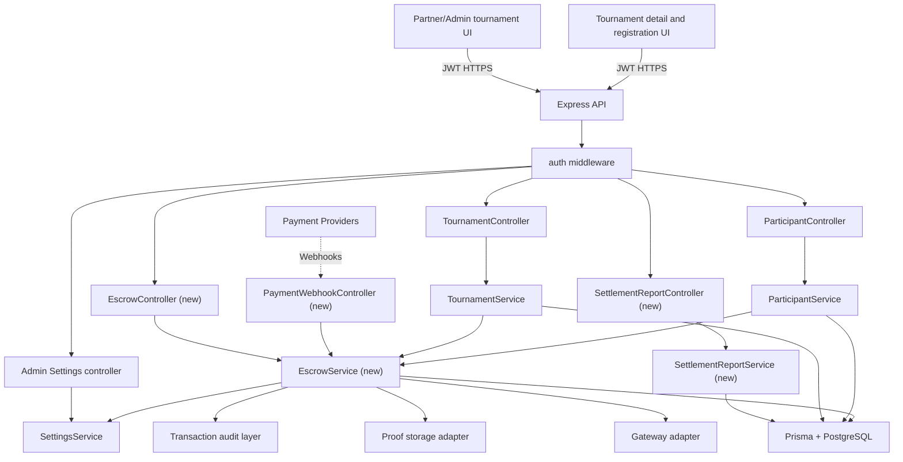

# System Design & Architecture

## Architecture Overview
**What is the high-level system structure?**

- The escrow layer becomes the source of truth for tournament funding, cancellation, lock, dispute, release, and payout reconciliation. Legacy `BalanceService` behavior must be removed from tournament money flows during migration, while `TransactionService` remains the audit/history layer.
- Community-mode classification is driven by admin-configurable settings, not hardcoded values inside tournament logic.
- Payment-provider webhooks are the primary confirmation mechanism for organizer funding and winner payout completion. Manual proof review remains an exception-handling path, not the default flow.
- Settlement reporting is a first-class read path so organizers and admins can audit tournament financial outcomes without querying raw transactions directly.

## Data Models
**What data do we need to manage?**

- `Tournament`
  - Keep current tournament metadata and public listing fields.
  - Add `escrowStatus` with values `not_funded`, `partially_funded`, `funded`, `locked`, `released`, `cancelled`, `disputed`.
  - Add `isCommunityMode` so UI and join logic can immediately tell whether escrow rules apply.
  - Add `escrowRequiredAmount` so the guaranteed amount is explicit.
  - Add `communityThresholdSnapshot` so later settings changes do not retroactively change historical classification.
- `Escrow`
  - Use a dedicated 1:1 relation with `Tournament`.
  - Proposed fields: `id`, `tournamentId`, `requiredAmount`, `fundedAmount`, `status`, `lockedAt`, `releasedAt`, `cancelledAt`, `disputedAt`, `cancelReason`, `fundingMethod`, `lastReviewedById`, `lastReviewedAt`, `latestWebhookEventId`, `reconciliationStatus`.
  - This model holds the current snapshot; detailed history lives in `Transaction`.
- `Transaction`
  - Extend the existing table rather than replacing it outright.
  - Add `tournamentId` and `escrowId` so every escrow-related movement is linked to the owning tournament.
  - Keep `status` aligned with the current codebase (`pending`, `success`, `failed`) during migration.
  - Add proof and reconciliation metadata such as `proofUrl`, `reviewedById`, `reviewedAt`, `reviewNotes`, `externalRefId`, `providerEventId`, `providerPayoutId`.
  - Support transaction types that distinguish escrow funding from participant fees and winner payouts, for example `escrow_deposit`, `entry_fee`, `refund`, `reward`, `payout`, `organizer_return`.
- `Participant`
  - Add `paymentStatus` for tournaments that require participant payment confirmation.
  - Keep `paid` only as a compatibility field during migration if existing screens still depend on it.
- `Reward`
  - Keep the current participant/tournament relationship.
  - Reward release must be gated by escrow state and payout reconciliation rather than immediately crediting a general wallet balance.
- `Admin settings / platform config`
  - Add settings keys such as `escrowCommunityThresholdUsd` and any related escrow policy flags.
  - Settings changes must be auditable and versioned enough to explain why a tournament was classified a certain way at creation time.
- `Settlement report`
  - Expose a derived read model per tournament rather than requiring a separate source-of-truth table.
  - Core sections: organizer funding, participant fees, gateway/platform fees, refunds, winner payouts, outstanding disputes, and net settlement summary.
- Data flow between components
  - Tournament creation reads the current threshold from settings and snapshots it onto the tournament.
  - Organizer funding submission creates a pending escrow-linked transaction.
  - Gateway webhook or approved manual review updates both the transaction status and the `Escrow` snapshot.
  - Tournament join/payment flows for both escrow-backed and community-mode tournaments create tournament-scoped participant payment records rather than relying on generic fiat wallet balances.
  - Tournament start checks the escrow snapshot, not raw wallet balances.
  - Pre-lock cancellation refunds participant fees, returns organizer funding when approved, and moves escrow to `cancelled` once reversals settle.
  - Tournament completion and payout release create reward and payout records that remain linked to the tournament.
  - Settlement reporting reads escrow snapshots plus transaction history to build a reconciled financial summary.

## API Design
**How do components communicate?**

- Existing endpoints to preserve and extend:
  - `GET /tournaments`
    - Public read.
    - Returns tournament list plus lightweight escrow summary fields such as `isCommunityMode`, `escrowStatus`, `escrowRequiredAmount`, and displayed guarantee amount.
  - `GET /tournaments/:id`
    - Public read, with organizer/admin-only escrow and settlement summary details added when authorized.
  - `POST /:tournamentId/join`
    - Auth: `user`.
    - For community mode, follows the same tournament-scoped participant payment-record path as escrow-backed tournaments, but skips organizer escrow-readiness gates because there is no platform guarantee.
    - For escrow-backed tournaments, checks escrow readiness and participant payment status before confirming join.
- New or changed escrow endpoints:
  - `POST /tournaments`
    - Auth: `admin`, `partner`.
    - Accepts tournament metadata plus enough pricing data to derive `escrowRequiredAmount`.
    - Reads the current threshold from settings and returns the created tournament together with its initial escrow summary.
  - `POST /tournaments/:id/escrow/funding`
    - Auth: organizer owner or `admin`.
    - Input: `amount`, `method`, optional proof payload or gateway initiation details.
    - Output: updated escrow snapshot and a pending funding transaction.
  - `POST /webhooks/payments/:provider`
    - Auth: provider signature validation instead of session auth.
    - Input: raw provider webhook payload.
    - Output: `200` after idempotent processing, with failures routed to alerting/retry handling.
  - `POST /tournaments/:id/payouts/request-release`
    - Auth: organizer owner or `admin`.
    - Input: approved result version and payout recipients.
    - Output: payout release request status.
  - `POST /admin/tournaments/:id/payouts/release`
    - Auth: `admin`.
    - Input: payout approval payload.
    - Output: created payout records and transition toward `released`, pending final provider reconciliation.
  - `POST /admin/tournaments/:id/dispute`
    - Auth: `admin`.
    - Input: dispute reason and optional freeze metadata.
    - Output: updated dispute state and escrow freeze indicator.
    - Note: this endpoint covers the approved freeze path only; final locked-tournament resolution actions such as partial release, full refund, or manual override remain provisional until product policy is confirmed.
  - `GET /partner/tournaments/:id/settlement-report`
    - Auth: organizer owner or `admin`.
    - Output: derived settlement report covering organizer funding, participant fees, payouts, fees, refunds, and unresolved issues.
    - Note: the first approved interface is the on-screen derived report; CSV/PDF export remains provisional until requirements confirm first-release scope.
  - `GET /admin/settings/escrow`
    - Auth: `admin`.
    - Output: current escrow-related settings including community threshold.
  - `PUT /admin/settings/escrow`
    - Auth: `admin`.
    - Input: escrow settings payload.
    - Output: updated settings and audit metadata.
- Authentication and authorization approach:
  - Reuse the existing `auth` middleware with `user`, `partner`, and `admin` roles.
  - Keep organizer ownership enforcement close to the controller/service boundary, following the current `TournamentController.ensureOwnership` pattern.
  - Admin-only actions include settings changes, payout release, dispute override, and manual exception review.
  - Provider webhooks bypass session auth but require strict signature validation and idempotency keys.

## Component Breakdown
**What are the major building blocks?**

- Frontend components
  - Tournament creation and edit screens in the partner/admin dashboard must expose escrow-backed vs community-mode state, organizer funding actions, and payout release requests.
  - Tournament detail and registration screens must show escrow badges, warning banners, funding progress, and join gating messages.
  - Admin settings screens must expose configurable escrow threshold and related policy values.
  - Admin review screens must list pending proofs, unreconciled webhook events, disputed tournaments, and payout approvals.
  - Organizer settlement screens must render the tournament settlement report; export actions are deferred until CSV/PDF scope is approved.
- Backend services and modules
  - `TournamentController` and `TournamentService`
    - Continue to own tournament CRUD, list/detail summaries, and organizer ownership checks.
    - Delegate funding and payout guarantees to the escrow layer rather than deriving them from wallet balances.
  - `ParticipantController` and `ParticipantService`
    - Continue to own registration, participant list/history, and removal flows.
    - Add tournament-scoped participant payment recording and payment-state checks for both escrow-backed and community-mode tournaments.
  - `EscrowController` and `EscrowService` (new)
    - Own funding submission, approval, pre-lock cancellation to `cancelled`, lock/release transitions, dispute handling, settings-driven classification, and cross-entity invariants.
    - Keep post-lock resolution mechanics beyond the initial `disputed` freeze provisional until product policy is confirmed.
  - `PaymentWebhookController` (new)
    - Own provider signature validation, idempotent event handling, and routing provider events into escrow reconciliation.
  - `SettlementReportController` and `SettlementReportService` (new)
    - Build the organizer/admin financial report from escrow and transaction state.
  - `TransactionService`
    - Remains the audit persistence layer during migration.
    - New escrow flows should call escrow logic first and use transaction records as history, not as the primary rule engine.
- Database and storage layer
  - Prisma/PostgreSQL remains the system of record for tournament, escrow, participant, reward, transaction, and settings state.
  - Proof storage should sit behind an adapter so manual exception flows can reuse the same review pipeline as automated gateway exceptions.
- Third-party integrations
  - Riot result synchronization remains upstream of payout approval.
  - Payment gateway adapters and webhook handlers are required integrations for organizer funding and payout reconciliation.

## Design Decisions
**Why did we choose this approach?**

- Dedicated `Escrow` model instead of embedding everything on `Tournament`
  - A 1:1 escrow record keeps the public tournament model smaller and gives funding, lock, release, dispute, and reconciliation data room to grow.
- Configurable threshold via admin settings instead of a hardcoded constant
  - Operations can tune the community-mode boundary without redeploying code, while `communityThresholdSnapshot` preserves historical correctness.
- Webhooks are authoritative for automated reconciliation
  - Funding and payout status cannot rely on client redirects or optimistic UI; provider events are the safest source of truth.
- Dedicated settlement report instead of ad hoc transaction inspection
  - Organizers need a clear financial report that separates guaranteed funding, participant fees, payouts, refunds, and fees.
- Extend `Transaction` instead of replacing it
  - The codebase already uses `Transaction` for tournament entry fees, refunds, and rewards. Extending it is lower risk than introducing multiple overlapping audit tables during migration.
- Migration boundary around `Balance.amount`
  - The current code still uses `Balance.amount` for tournament entry fees and payouts. The migration must move both escrow-backed and community-mode tournaments onto tournament-scoped transaction records, leaving legacy wallet behavior only for non-tournament balance features that remain in scope.
- Admin remains the final payout-release authority
  - Automation handles reconciliation and status updates, but final payout release and dispute resolution remain admin-controlled to reduce fraud and payout mistakes.

## Non-Functional Requirements
**How should the system perform?**

- Security requirements
  - All escrow mutations require authenticated `partner` or `admin` users, with organizer ownership checks for partner-managed tournaments.
  - Funding review, settings changes, dispute overrides, and admin payout release actions must be auditable.
  - Webhook endpoints must validate provider signatures and reject replayed or tampered events.
  - Tournament-linked participant payments and payouts must never be derived from client-provided balances or unchecked `Balance.amount` values.
- Reliability and availability needs
  - Funding approval, cancellation, lock, dispute, release, and webhook reconciliation transitions must be transactional and idempotent.
  - A disputed or underfunded escrow must hard-block payout release.
  - Manual review remains available if gateway confirmation or proof storage is temporarily unavailable.
  - Settings changes must not retroactively reclassify already-created tournaments.
- Performance targets
  - Public tournament list and detail endpoints should expose escrow summary fields without loading full transaction history by default.
  - Escrow checks in join and start flows should be simple indexed reads against tournament and escrow snapshots.
  - Settlement report generation should be efficient enough to render on demand for a single tournament without scanning unrelated transaction history.
- Scalability considerations
  - The design separates snapshot reads (`Tournament`, `Escrow`) from detailed audit history (`Transaction`) so most reads remain cheap even as funding and payout history grows.
  - Webhook processing must support retry-safe operation and queue-backed expansion if provider traffic increases.
